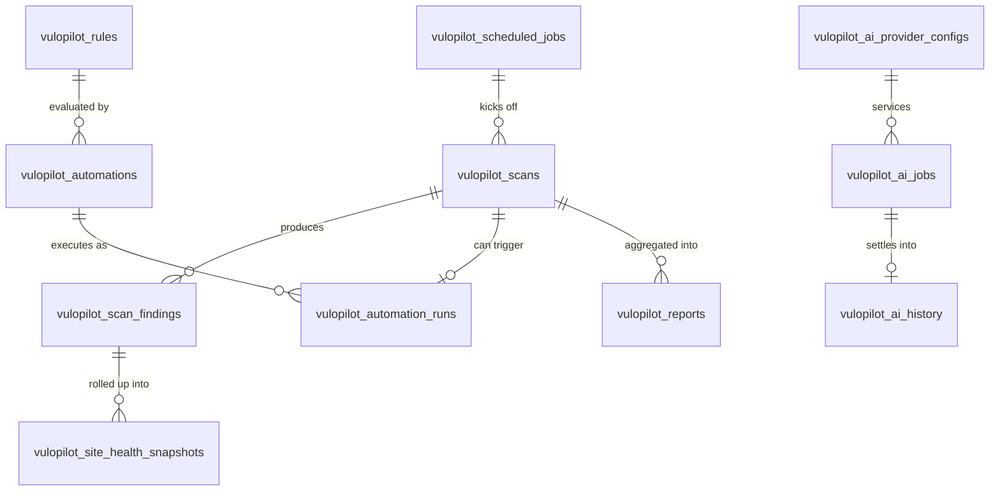

# VuloPilot — database schema

Companion to [`plugins/vulopilot-pro/ARCHITECTURE.md`](../../../plugins/vulopilot-pro/ARCHITECTURE.md).
All tables below live in the **Free** plugin's schema (`Utill::TABLES`, created by Free's
`Install.php`) — per `.claude/rules/database.md`, table ownership is centralized in the free
plugin for every existing product line, and VuloPilot Pro has no independent database of its own.
A Pro-only feature (e.g. `ComplianceReports`) still writes into a table defined here; it just
leaves that table empty/unused until the module is licensed and active. This avoids splitting
migration ownership across two plugins, which nothing in this repo does today.

## Design principles (matched against the real schema in `multivendorx/plugins/multivendorx/classes/Install.php`)

- **`bigint(20) unsigned` primary keys, `AUTO_INCREMENT`, lower-case `id`** — the existing schema is
  inconsistent between `` `ID` `` and `` `id` `` across tables (legacy vs. newer ones, e.g.
  `transaction` uses lower-case `id` with `unsigned`, older tables use `` `ID` `` without
  `unsigned`). VuloPilot is new, so it standardizes on the newer, stricter `transaction`-table style
  throughout: lower-case `id`, `unsigned` on every bigint.
- **Typed foreign-key *columns*, not real `FOREIGN KEY ... REFERENCES` constraints.** Grepping
  `Install.php` shows zero `REFERENCES`/`FOREIGN KEY` clauses anywhere in the existing schema —
  this codebase relies on plain indexed `bigint` columns (`store_id`, `order_id`,
  `commission_id`) plus application-layer integrity (the Repository classes), not database-enforced
  referential integrity. This is also a `dbDelta()` limitation (it doesn't reliably diff constraint
  clauses) and matches WordPress core's own tables (`wp_postmeta`, `wp_options` have no FKs
  either). VuloPilot follows the same convention — every `*_id` column below is a plain indexed
  `bigint(20) unsigned`, not a constraint.
- **`object_type` + `object_id` only where the target genuinely varies by row** (`vulopilot_scan_findings.object_ref`,
  `vulopilot_ai_jobs`/`vulopilot_ai_history`/`vulopilot_activity_logs`). This isn't a general
  polymorphic-association framework bolted on — the existing schema always uses a specific typed
  column (`store_id`, `product_id`) when the target is a single known entity, and this design does
  the same everywhere a specific target type exists (`vulopilot_automations.rule_id`,
  `vulopilot_automation_runs.automation_id`). The generic pair is used strictly for the handful of
  tables whose whole purpose is to reference heterogeneous, unpredictable targets (a finding might
  be about a plugin slug, a file path, or a URL — no single typed column works there).
- **`longtext` for JSON payloads**, matching the existing `commission_note`/similar `longtext`
  columns — no existing table uses MySQL's native `JSON` column type, so this doesn't introduce a
  new column type the rest of the schema doesn't use. Encode/decode via `wp_json_encode()`/
  `json_decode()` in the Repository layer, same as any other serialized column in this codebase.
- **`$wpdb->get_charset_collate()`, `CREATE TABLE IF NOT EXISTS`, `dbDelta()`** — identical to
  every existing migration block.
- **No table is deleted or repurposed by a later migration** — additive only, per
  `.claude/rules/backward-compatibility.md`.

## Table registry (`Utill::TABLES` addition, free plugin)

```php
const TABLES = array(
    'scan'                  => 'vulopilot_scans',
    'scan_finding'           => 'vulopilot_scan_findings',
    'rule'                   => 'vulopilot_rules',
    'automation'             => 'vulopilot_automations',
    'automation_run'         => 'vulopilot_automation_runs',
    'ai_job'                 => 'vulopilot_ai_jobs',
    'ai_history'             => 'vulopilot_ai_history',
    'ai_provider_config'     => 'vulopilot_ai_provider_configs',
    'report'                 => 'vulopilot_reports',
    'scheduled_job'          => 'vulopilot_scheduled_jobs',
    'activity_log'           => 'vulopilot_activity_logs',
    'site_health_snapshot'   => 'vulopilot_site_health_snapshots',
    'ai_action_run'          => 'vulopilot_ai_action_runs',
);
```

`ai_action_run` was added in the AI Actions pass — see [`AI-ACTIONS.md`](AI-ACTIONS.md) for its
full design (table #13, documented after table 12 below rather than renumbering everything).

## Entity relationships



---

## 1. `vulopilot_scans` — a single scan run

One row per invocation of any scanner (free or premium), regardless of what triggered it. This is
the parent of `vulopilot_scan_findings` and the thing `vulopilot_scheduled_jobs`/
`vulopilot_automations` point at when they say "run a scan."

```sql
CREATE TABLE IF NOT EXISTS `{$wpdb->prefix}vulopilot_scans` (
    `id`            bigint(20) unsigned NOT NULL AUTO_INCREMENT,
    `scanner_id`    varchar(100) NOT NULL,
    `scanner_tier`  varchar(20) NOT NULL DEFAULT 'free',
    `status`        varchar(20) NOT NULL DEFAULT 'queued',
    `trigger_type`  varchar(20) NOT NULL DEFAULT 'manual',
    `triggered_by`  bigint(20) unsigned DEFAULT NULL,
    `started_at`    datetime DEFAULT NULL,
    `finished_at`   datetime DEFAULT NULL,
    `duration_ms`   int(10) unsigned DEFAULT NULL,
    `summary`       longtext DEFAULT NULL,
    `error_message` text DEFAULT NULL,
    `created_at`    timestamp NOT NULL DEFAULT CURRENT_TIMESTAMP,
    PRIMARY KEY (`id`),
    KEY `idx_scanner` (`scanner_id`),
    KEY `idx_status` (`status`),
    KEY `idx_created` (`created_at`)
) $collate;
```

- `scanner_id` — the scanner's registered id from `ScannerRegistry` (free scanner slug, or a Pro
  module's scanner slug) — a string, not a typed FK, because scanners aren't rows in a table, they're
  code registered via the `vulopilot_scanner_sources` filter.
- `scanner_tier` (`free`/`premium`) — denormalized so the dashboard's scan-history list can filter
  by tier without joining back to the module registry (`.claude/rules/performance.md`'s
  "prefer a single query" guidance, applied to a list endpoint).
- `status` (`queued`/`running`/`completed`/`failed`/`cancelled`) — `idx_status` backs the
  `Scans` REST controller's list-filter-by-status query and the Scheduler's "any stuck scans"
  health check.
- `trigger_type` (`manual`/`scheduled`/`automation`) + `triggered_by` (user id, `NULL` if system) —
  who/what asked for this scan; needed for the activity log and for "run manually" UI affordances.
- `summary` — JSON rollup (finding counts by severity) computed once the scan finishes, so the
  dashboard's scan list doesn't have to `COUNT()` `vulopilot_scan_findings` per row on every page
  load.
- `idx_created` — every list endpoint here is ordered by recency; an unindexed `created_at` sort on
  a growing table is the first thing that gets slow.

## 2. `vulopilot_scan_findings` — individual findings from a scan

```sql
CREATE TABLE IF NOT EXISTS `{$wpdb->prefix}vulopilot_scan_findings` (
    `id`            bigint(20) unsigned NOT NULL AUTO_INCREMENT,
    `scan_id`       bigint(20) unsigned NOT NULL,
    `scanner_id`    varchar(100) NOT NULL,
    `severity`      varchar(20) NOT NULL DEFAULT 'info',
    `category`      varchar(50) NOT NULL,
    `title`         varchar(255) NOT NULL,
    `description`   longtext DEFAULT NULL,
    `object_type`   varchar(50) DEFAULT NULL,
    `object_ref`    varchar(255) DEFAULT NULL,
    `status`        varchar(20) NOT NULL DEFAULT 'open',
    `resolved_at`   datetime DEFAULT NULL,
    `meta`          longtext DEFAULT NULL,
    `created_at`    timestamp NOT NULL DEFAULT CURRENT_TIMESTAMP,
    PRIMARY KEY (`id`),
    KEY `idx_scan` (`scan_id`),
    KEY `idx_severity` (`severity`),
    KEY `idx_status` (`status`),
    KEY `idx_category` (`category`)
) $collate;
```

- `scan_id` — typed FK column to `vulopilot_scans.id`; `idx_scan` is what makes "show findings for
  this scan" (the dashboard's primary findings view) an indexed lookup instead of a table scan.
- `scanner_id` — denormalized from the parent scan so "all open critical findings across every
  scan, by scanner" doesn't require a join, matching the `performance.md` guidance to prefer a
  single indexed query over a join-per-row pattern for list endpoints.
- `severity` (`critical`/`high`/`medium`/`low`/`info`) — `idx_severity` backs the dashboard's
  "critical findings" widget and the Rule Engine's `finding.severity` condition type.
- `object_type` + `object_ref` — the one deliberate use of the loose polymorphic pair (see design
  principles above): a finding might be about a plugin slug, a theme, a core file, a URL, or a
  database table — there's no single typed entity table to point a real FK at.
- `status` (`open`/`resolved`/`ignored`/`snoozed`) — separate from `vulopilot_scans.status`; a scan
  finishes once, but a finding's lifecycle continues independently (someone can resolve/snooze it
  days later). `idx_status` backs the default "open findings" dashboard filter.

## 3. `vulopilot_rules` — condition definitions (Rule Engine)

```sql
CREATE TABLE IF NOT EXISTS `{$wpdb->prefix}vulopilot_rules` (
    `id`              bigint(20) unsigned NOT NULL AUTO_INCREMENT,
    `name`            varchar(191) NOT NULL,
    `description`     text DEFAULT NULL,
    `condition_tree`  longtext NOT NULL,
    `is_active`       tinyint(1) NOT NULL DEFAULT 1,
    `created_by`      bigint(20) unsigned DEFAULT NULL,
    `created_at`      timestamp NOT NULL DEFAULT CURRENT_TIMESTAMP,
    `updated_at`      timestamp NOT NULL DEFAULT CURRENT_TIMESTAMP ON UPDATE CURRENT_TIMESTAMP,
    PRIMARY KEY (`id`),
    KEY `idx_active` (`is_active`)
) $collate;
```

- Deliberately separate from `vulopilot_automations` (not one merged table): a rule is a reusable
  condition tree (evaluated by `RuleEngine`/`ConditionRegistry`), and more than one automation can
  reuse the same rule (e.g. "any critical finding exists" gates both an email automation and an
  auto-rollback automation). Merging them would force duplicating the condition tree per automation.
- `condition_tree` — JSON, the nested condition/operator structure `RuleEngine.php` evaluates; each
  leaf condition type is whatever's registered via `vulopilot_condition_sources` (free or Pro).
- `is_active` lets a rule be disabled without deleting it (and without cascading to every automation
  that references it) — `idx_active` backs the "only evaluate active rules" query the engine runs on
  every tick.

## 4. `vulopilot_automations` — binds a rule to actions + a trigger

```sql
CREATE TABLE IF NOT EXISTS `{$wpdb->prefix}vulopilot_automations` (
    `id`                  bigint(20) unsigned NOT NULL AUTO_INCREMENT,
    `name`                varchar(191) NOT NULL,
    `rule_id`             bigint(20) unsigned NOT NULL,
    `trigger_type`        varchar(50) NOT NULL,
    `trigger_config`      longtext DEFAULT NULL,
    `actions`             longtext NOT NULL,
    `status`              varchar(20) NOT NULL DEFAULT 'enabled',
    `last_triggered_at`   datetime DEFAULT NULL,
    `created_by`          bigint(20) unsigned DEFAULT NULL,
    `created_at`          timestamp NOT NULL DEFAULT CURRENT_TIMESTAMP,
    `updated_at`          timestamp NOT NULL DEFAULT CURRENT_TIMESTAMP ON UPDATE CURRENT_TIMESTAMP,
    PRIMARY KEY (`id`),
    KEY `idx_rule` (`rule_id`),
    KEY `idx_status` (`status`),
    KEY `idx_trigger_type` (`trigger_type`)
) $collate;
```

- `rule_id` — typed FK to `vulopilot_rules.id`; `idx_rule` backs "which automations use this rule"
  (needed before letting someone delete/deactivate a rule).
- `trigger_type` (`schedule`/`on_scan_complete`/`webhook`/`finding_created`) + `trigger_config` (JSON
  — a cron expression, a webhook secret, etc.) — what actually fires evaluation of `rule_id`.
  `idx_trigger_type` backs the Scheduler's "which automations need a cron tick" query.
- `actions` — JSON ordered list of `{action_id, config}`; each `action_id` is whatever's registered
  via `vulopilot_action_sources` (free `Actions/` or a Pro module's actions). Keeping this as one
  JSON column rather than a child table keeps ordering trivial and matches how `condition_tree`
  above is also a single structured column, not a separate table per node.
- `status` (`enabled`/`disabled`) mirrors `vulopilot_rules.is_active`'s reasoning — pause without
  delete.

## 5. `vulopilot_automation_runs` — execution history of automations

```sql
CREATE TABLE IF NOT EXISTS `{$wpdb->prefix}vulopilot_automation_runs` (
    `id`                bigint(20) unsigned NOT NULL AUTO_INCREMENT,
    `automation_id`     bigint(20) unsigned NOT NULL,
    `triggered_by`      varchar(50) NOT NULL,
    `trigger_ref_id`    bigint(20) unsigned DEFAULT NULL,
    `status`            varchar(20) NOT NULL DEFAULT 'running',
    `actions_executed`  int(10) unsigned NOT NULL DEFAULT 0,
    `actions_failed`    int(10) unsigned NOT NULL DEFAULT 0,
    `result_log`        longtext DEFAULT NULL,
    `started_at`        datetime NOT NULL,
    `finished_at`       datetime DEFAULT NULL,
    `created_at`        timestamp NOT NULL DEFAULT CURRENT_TIMESTAMP,
    PRIMARY KEY (`id`),
    KEY `idx_automation` (`automation_id`),
    KEY `idx_status` (`status`),
    KEY `idx_started` (`started_at`)
) $collate;
```

- Separate from `vulopilot_automations` for the same reason `vulopilot_scans` is separate from the
  scanner registry: the automation is the *definition* (edited rarely), a run is an *event* (written
  every time it fires, potentially very often) — mixing update-rarely config columns with
  write-constantly history columns on one table just makes the config rows wider and the history
  rows sparser than they need to be.
- `trigger_ref_id` — e.g. the `vulopilot_scans.id` that caused an `on_scan_complete` automation to
  fire; nullable because `schedule`/`manual` triggers have no such reference.
- `result_log` — JSON, one entry per action executed (`{action_id, status, message}`) — the concrete
  audit trail an admin reads when an automation "did something" and they need to know what.

## 6. `vulopilot_ai_jobs` — queued/in-flight AI provider requests

```sql
CREATE TABLE IF NOT EXISTS `{$wpdb->prefix}vulopilot_ai_jobs` (
    `id`                bigint(20) unsigned NOT NULL AUTO_INCREMENT,
    `job_type`          varchar(50) NOT NULL,
    `provider`          varchar(50) NOT NULL,
    `model`             varchar(100) DEFAULT NULL,
    `status`            varchar(20) NOT NULL DEFAULT 'queued',
    `priority`          tinyint(3) unsigned NOT NULL DEFAULT 5,
    `object_type`       varchar(50) DEFAULT NULL,
    `object_id`         bigint(20) unsigned DEFAULT NULL,
    `request_payload`   longtext NOT NULL,
    `attempts`          tinyint(3) unsigned NOT NULL DEFAULT 0,
    `requested_by`      bigint(20) unsigned DEFAULT NULL,
    `created_at`        timestamp NOT NULL DEFAULT CURRENT_TIMESTAMP,
    `started_at`        datetime DEFAULT NULL,
    `completed_at`      datetime DEFAULT NULL,
    `error_message`     text DEFAULT NULL,
    PRIMARY KEY (`id`),
    KEY `idx_status_priority` (`status`, `priority`),
    KEY `idx_object` (`object_type`, `object_id`)
) $collate;
```

- This is the **work queue**, not the audit ledger (that's `vulopilot_ai_history` below) — rows here
  are operationally transient: created queued, updated as they process, and are safe to prune once
  completed (their permanent record lives in `ai_history`).
- `job_type` (`summarize_findings`/`explain_finding`/`suggest_automation`/`generate_report_summary`,
  etc.) — what kind of AI call this is; drives which `PromptTemplates/` entry gets used.
- `object_type`/`object_id` — the loose pair again, used here because a job's subject varies
  (a finding, a scan, a report) the same way a finding's subject varies above.
- `idx_status_priority` — a composite index because the job runner's actual query is always "next
  queued job, highest priority first" (`WHERE status = 'queued' ORDER BY priority DESC, id ASC`); a
  single-column index on `status` alone would still need a filesort for the `priority` ordering.

## 7. `vulopilot_ai_history` — permanent ledger of completed AI calls

```sql
CREATE TABLE IF NOT EXISTS `{$wpdb->prefix}vulopilot_ai_history` (
    `id`                  bigint(20) unsigned NOT NULL AUTO_INCREMENT,
    `job_id`              bigint(20) unsigned DEFAULT NULL,
    `provider`            varchar(50) NOT NULL,
    `model`               varchar(100) DEFAULT NULL,
    `object_type`         varchar(50) DEFAULT NULL,
    `object_id`           bigint(20) unsigned DEFAULT NULL,
    `prompt_tokens`       int(10) unsigned DEFAULT NULL,
    `completion_tokens`   int(10) unsigned DEFAULT NULL,
    `cost_estimate`       decimal(10,4) DEFAULT NULL,
    `status`              varchar(20) NOT NULL,
    `response_excerpt`    text DEFAULT NULL,
    `requested_by`        bigint(20) unsigned DEFAULT NULL,
    `created_at`          timestamp NOT NULL DEFAULT CURRENT_TIMESTAMP,
    PRIMARY KEY (`id`),
    KEY `idx_provider` (`provider`),
    KEY `idx_created` (`created_at`),
    KEY `idx_object` (`object_type`, `object_id`)
) $collate;
```

- `job_id` is nullable and deliberately **not** the primary key relationship — a synchronous AI call
  (small enough to not need queueing) can write straight to `ai_history` without ever having a row in
  `ai_jobs`. Every async job, once it completes, writes exactly one `ai_history` row referencing it.
- `prompt_tokens`/`completion_tokens`/`cost_estimate` — this is the table `vulopilot_ai_provider_configs.quota_used`
  gets recalculated from and what a future billing/usage screen queries; keeping it append-only and
  separate from the job queue means quota math never has to account for jobs being pruned.
- `response_excerpt`, not the full response — this is an audit trail, not a cache; storing full AI
  responses indefinitely is a data-retention/PII surface area this design avoids by only keeping
  enough to show "what did the AI say" in an audit view.

## 8. `vulopilot_ai_provider_configs` — configured AI provider credentials

```sql
CREATE TABLE IF NOT EXISTS `{$wpdb->prefix}vulopilot_ai_provider_configs` (
    `id`                bigint(20) unsigned NOT NULL AUTO_INCREMENT,
    `provider`          varchar(50) NOT NULL,
    `label`             varchar(191) DEFAULT NULL,
    `credentials`       longtext NOT NULL,
    `default_model`     varchar(100) DEFAULT NULL,
    `is_active`         tinyint(1) NOT NULL DEFAULT 1,
    `quota_limit`       int(10) unsigned DEFAULT NULL,
    `quota_used`        int(10) unsigned NOT NULL DEFAULT 0,
    `quota_reset_at`    datetime DEFAULT NULL,
    `created_at`        timestamp NOT NULL DEFAULT CURRENT_TIMESTAMP,
    `updated_at`        timestamp NOT NULL DEFAULT CURRENT_TIMESTAMP ON UPDATE CURRENT_TIMESTAMP,
    PRIMARY KEY (`id`),
    UNIQUE KEY `uniq_provider` (`provider`),
    KEY `idx_active` (`is_active`)
) $collate;
```

- **`credentials` must never hold a plaintext API key.** This is flagged in `ARCHITECTURE.md` too:
  nothing in this repo today encrypts a secret at rest (the existing `LicenseManager` stores a
  *license key*, which is validated against MultiVendorX's own server, not a third-party API
  credential with direct spend risk) — so this column's encryption approach is new ground for the
  codebase, not a pattern being copied. At minimum: encrypt with a key derived from WordPress's own
  `AUTH_KEY`/`SECURE_AUTH_KEY` salts (never store the encryption key in the same table/row), decrypt
  only inside the `AIProviders/Providers/*` class that makes the actual HTTP call, and never return
  `credentials` from any REST response (the `Providers` controller should expose `label`,
  `provider`, `is_active`, `default_model`, masked-last-4 only).
- `quota_limit`/`quota_used`/`quota_reset_at` — free tier's built-in rate limiting on the default
  provider, and the mechanism Pro's `MultiProviderAI` module reuses per-provider rather than
  inventing its own quota system.
- `UNIQUE KEY uniq_provider` — one configuration row per provider slug; re-saving a provider's
  settings is an `UPDATE`, not an `INSERT`, by design.

## 9. `vulopilot_reports` — generated reports

```sql
CREATE TABLE IF NOT EXISTS `{$wpdb->prefix}vulopilot_reports` (
    `id`             bigint(20) unsigned NOT NULL AUTO_INCREMENT,
    `report_type`    varchar(50) NOT NULL,
    `format`         varchar(10) NOT NULL DEFAULT 'pdf',
    `period_start`   date DEFAULT NULL,
    `period_end`     date DEFAULT NULL,
    `status`         varchar(20) NOT NULL DEFAULT 'generating',
    `file_path`      varchar(255) DEFAULT NULL,
    `generated_by`   bigint(20) unsigned DEFAULT NULL,
    `meta`           longtext DEFAULT NULL,
    `created_at`     timestamp NOT NULL DEFAULT CURRENT_TIMESTAMP,
    PRIMARY KEY (`id`),
    KEY `idx_type` (`report_type`),
    KEY `idx_status` (`status`),
    KEY `idx_period` (`period_start`, `period_end`)
) $collate;
```

- `file_path` — a path under `wp-content/uploads/vulopilot-reports/` (or similar), never a
  web-reachable URL returned directly; the REST download endpoint should stream the file through a
  permission-checked handler rather than exposing the path, same "don't trust the client with a raw
  path" posture as `security.md`'s escaping/sanitizing baseline.
- `meta` — JSON: which `scan_id`s/date range fed this report, filters applied — lets a report be
  regenerated or its provenance inspected without re-deriving it from `period_start`/`period_end`
  alone.
- This table exists in Free's schema even though report *generation* is a Pro module
  (`ComplianceReports`) — see the file-level note at the top: schema ownership doesn't fragment by
  license tier.

## 10. `vulopilot_scheduled_jobs` — Scheduler's queryable job registry

```sql
CREATE TABLE IF NOT EXISTS `{$wpdb->prefix}vulopilot_scheduled_jobs` (
    `id`                bigint(20) unsigned NOT NULL AUTO_INCREMENT,
    `job_key`           varchar(100) NOT NULL,
    `job_type`          varchar(50) NOT NULL,
    `schedule`          varchar(50) NOT NULL,
    `config`            longtext DEFAULT NULL,
    `is_enabled`        tinyint(1) NOT NULL DEFAULT 1,
    `next_run_at`       datetime DEFAULT NULL,
    `last_run_at`       datetime DEFAULT NULL,
    `last_run_status`   varchar(20) DEFAULT NULL,
    `created_at`        timestamp NOT NULL DEFAULT CURRENT_TIMESTAMP,
    `updated_at`        timestamp NOT NULL DEFAULT CURRENT_TIMESTAMP ON UPDATE CURRENT_TIMESTAMP,
    PRIMARY KEY (`id`),
    UNIQUE KEY `uniq_job_key` (`job_key`),
    KEY `idx_enabled` (`is_enabled`),
    KEY `idx_next_run` (`next_run_at`)
) $collate;
```

- **This does not replace `wp_schedule_event()`/wp-cron** — the actual scheduling still goes through
  WordPress core's cron API, same as the existing `Cron.php` pattern. This table is a *companion*
  queryable projection: wp-cron's own storage (a single serialized array in the `cron` option) can't
  be efficiently listed, sorted, or filtered by a REST endpoint, and it has no concept of "did the
  last run succeed." `Scheduler.php` writes/updates a row here every time it schedules or runs a job,
  purely so the dashboard's "Scheduled Jobs" screen and the `Scans`/monitoring REST endpoints have
  something to query.
- `job_key` unique — one row per distinct scheduled job (`daily-core-scan`,
  `weekly-compliance-report`, `ai-quota-reset`), matching how `wp_schedule_event()` itself is keyed
  by hook name + args.
- `last_run_status` — what lets the dashboard surface "this scheduled scan has been failing for 3
  days" instead of only showing that it's scheduled at all.

## 11. `vulopilot_activity_logs` — general audit trail

```sql
CREATE TABLE IF NOT EXISTS `{$wpdb->prefix}vulopilot_activity_logs` (
    `id`            bigint(20) unsigned NOT NULL AUTO_INCREMENT,
    `event_type`    varchar(100) NOT NULL,
    `object_type`   varchar(50) DEFAULT NULL,
    `object_id`     bigint(20) unsigned DEFAULT NULL,
    `actor_type`    varchar(20) NOT NULL DEFAULT 'system',
    `actor_id`      bigint(20) unsigned DEFAULT NULL,
    `message`       text NOT NULL,
    `severity`      varchar(20) NOT NULL DEFAULT 'info',
    `meta`          longtext DEFAULT NULL,
    `created_at`    timestamp NOT NULL DEFAULT CURRENT_TIMESTAMP,
    PRIMARY KEY (`id`),
    KEY `idx_event` (`event_type`),
    KEY `idx_object` (`object_type`, `object_id`),
    KEY `idx_created` (`created_at`)
) $collate;
```

- Directly mirrors the real `multivendorx_activity_logs` table's shape (`` `ID` ``, `message`,
  `tag`→`event_type`, `date`→`created_at`) with two additions the existing table doesn't need:
  `object_type`/`object_id` (VuloPilot's log entries reference many different entity types — scans,
  rules, automations, AI jobs — where the marketplace log is scoped to one thing, a store) and
  `actor_type`/`actor_id` (VuloPilot logs system/automation-originated events, not only user
  actions, so "who did this" needs a type discriminator the marketplace log doesn't need).
- `severity` reuses the same vocabulary as `vulopilot_scan_findings.severity` deliberately, so the
  dashboard's existing severity badge component (a Zyra status-badge instance) renders both without
  a second color-mapping table (`.claude/rules/accessibility.md`'s "color is never the only signal"
  guidance applies equally here — pair with the text label, which `event_type`/`message` already
  provide).

## 12. `vulopilot_site_health_snapshots` — daily aggregate rollup

```sql
CREATE TABLE IF NOT EXISTS `{$wpdb->prefix}vulopilot_site_health_snapshots` (
    `id`                  bigint(20) unsigned NOT NULL AUTO_INCREMENT,
    `snapshot_date`       date NOT NULL,
    `overall_score`       tinyint(3) unsigned NOT NULL,
    `security_score`      tinyint(3) unsigned DEFAULT NULL,
    `performance_score`   tinyint(3) unsigned DEFAULT NULL,
    `seo_score`           tinyint(3) unsigned DEFAULT NULL,
    `uptime_score`        tinyint(3) unsigned DEFAULT NULL,
    `critical_count`      int(10) unsigned NOT NULL DEFAULT 0,
    `high_count`          int(10) unsigned NOT NULL DEFAULT 0,
    `medium_count`        int(10) unsigned NOT NULL DEFAULT 0,
    `low_count`           int(10) unsigned NOT NULL DEFAULT 0,
    `created_at`          timestamp NOT NULL DEFAULT CURRENT_TIMESTAMP,
    PRIMARY KEY (`id`),
    UNIQUE KEY `uniq_snapshot_date` (`snapshot_date`)
) $collate;
```

- **Why this exists separately from just querying `vulopilot_scan_findings` live**: the dashboard's
  headline feature is a health-score trend chart (score over the last 30/90 days). Computing that by
  aggregating potentially tens of thousands of finding rows on every dashboard load is exactly the
  kind of query `.claude/rules/performance.md` warns against — this table is a once-daily
  precomputed rollup (written by a `vulopilot_scheduled_jobs` entry after each day's scans finish) so
  the trend chart is a single indexed range query (`WHERE snapshot_date BETWEEN ? AND ?`) instead of
  a live aggregation.
- `UNIQUE KEY uniq_snapshot_date` — enforces one rollup per day; the scheduled job that writes this
  does an upsert (`ON DUPLICATE KEY UPDATE`) so re-running it the same day is idempotent.

## 13. `vulopilot_ai_action_runs` — AI Action propose/approve/execute/rollback history

Added in the AI Actions pass — see [`AI-ACTIONS.md`](AI-ACTIONS.md) for the full design (the
8-stage action lifecycle this table exists to bridge). Full column list there; short version:

```sql
CREATE TABLE IF NOT EXISTS `{$wpdb->prefix}vulopilot_ai_action_runs` (
    `id`             bigint(20) unsigned NOT NULL AUTO_INCREMENT,
    `action_id`      varchar(100) NOT NULL,
    `status`         varchar(20) NOT NULL DEFAULT 'pending_approval',
    `object_type`    varchar(50) DEFAULT NULL,
    `object_ref`     varchar(255) DEFAULT NULL,
    `input`          longtext DEFAULT NULL,
    `output`         longtext DEFAULT NULL,
    `preview`        longtext DEFAULT NULL,
    `snapshot`       longtext DEFAULT NULL,
    `error_message`  text DEFAULT NULL,
    `requested_by`   bigint(20) unsigned DEFAULT NULL,
    `approved_by`    bigint(20) unsigned DEFAULT NULL,
    `created_at`     timestamp NOT NULL DEFAULT CURRENT_TIMESTAMP,
    `approved_at`    datetime DEFAULT NULL,
    `executed_at`    datetime DEFAULT NULL,
    `rolled_back_at` datetime DEFAULT NULL,
    PRIMARY KEY (`id`),
    KEY `idx_action` (`action_id`),
    KEY `idx_status` (`status`),
    KEY `idx_object` (`object_type`, `object_ref`)
) $collate;
```

- Why a new table rather than reusing `vulopilot_activity_logs` or `vulopilot_ai_history`:
  neither carries a `status` a workflow can transition through (`pending_approval` →
  `executed`/`rejected` → `rolled_back`), and only this table needs to hold `snapshot` — the data
  `rollback()` actually reads back out. Every stage transition still *also* writes a
  `vulopilot_activity_logs` row (AI-ACTIONS.md's stage 8) — this table is state, activity_logs is
  the audit trail; they serve different reads.
- `snapshot` shape is entirely action-specific (a previous meta value, previous `post_content`, or
  just a newly-created post id to trash) — this table stores whatever JSON an action's own
  `execute()` produced, never interprets it.

---

## Settings — deliberately **not** a new table

Per `.claude/rules/backward-compatibility.md`: "New settings should be added through the existing
`MULTIVENDORX_SETTINGS`/`multivendorx_register_settings_keys` filter mechanism ... rather than a new
bespoke `get_option()` call." VuloPilot follows the same pattern with its own registry:
`Utill::VULOPILOT_SETTINGS` (an array of setting keys → `wp_options` option names), extended by a
`vulopilot_register_settings_keys` filter the same way Pro's bootstrap extends the marketplace one.
Plain scalar/flat settings (scan frequency defaults, notification email, dashboard preferences) are
`wp_options` rows, not a custom table — a table would only be justified if settings needed to be
queried/joined/paginated the way the entities above do, and they don't. Anything that looks like
"settings" but is actually structured, queryable, per-row config already has a home above:
per-provider config → `vulopilot_ai_provider_configs`, per-automation config → `vulopilot_automations.trigger_config`/`actions`,
per-scheduled-job config → `vulopilot_scheduled_jobs.config`.

## Migration strategy

Same versioned pattern as the existing `Install.php` — `do_migration()` gated on
`version_compare(get_option('vulopilot_version'), $target, '<')`, each table created with
`CREATE TABLE IF NOT EXISTS` + `dbDelta()`, one version bump per schema change, never a `DROP`:

```php
public function do_migration() {
    $previous_version = get_option( 'vulopilot_version', '' );

    if ( version_compare( $previous_version, '1.0.0', '<' ) ) {
        global $wpdb;
        $collate = $wpdb->get_charset_collate();

        if ( ! function_exists( 'dbDelta' ) ) {
            require_once ABSPATH . 'wp-admin/includes/upgrade.php';
        }

        // All thirteen CREATE TABLE statements above, each through dbDelta().
        dbDelta( $sql_scans );
        dbDelta( $sql_scan_findings );
        dbDelta( $sql_rules );
        dbDelta( $sql_automations );
        dbDelta( $sql_automation_runs );
        dbDelta( $sql_ai_jobs );
        dbDelta( $sql_ai_history );
        dbDelta( $sql_ai_provider_configs );
        dbDelta( $sql_reports );
        dbDelta( $sql_scheduled_jobs );
        dbDelta( $sql_activity_logs );
        dbDelta( $sql_site_health_snapshots );
        dbDelta( $sql_ai_action_runs );
    }

    // Future schema changes get their own version-gated block here — ADD COLUMN /
    // ADD INDEX only, per backward-compatibility.md. Never DROP a column an older
    // running copy of the plugin (mid-upgrade, multisite) might still read.
}
```

- **`vulopilot_ai_action_runs` (table 13) was added directly to this same `1.0.0` baseline**, not a
  version-gated `1.1.0` block, matching `AI-ACTIONS.md`'s reasoning: there is no real deployed
  `1.0.0` install of this still-in-development plugin to preserve compatibility with yet, so a
  fake version bump would misrepresent the schema's actual history rather than reflect it. Once
  this plugin genuinely ships, *that* baseline becomes the one later changes version-gate against.
- **Seed migration (`1.0.0`)** creates all thirteen tables in one pass, run on activation
  (`Install::__construct()` → `run_migration()` on `init`, same trigger as the existing `Install.php`)
  and on first version bump for upgrading sites.
- **Every later schema change is its own version-gated block**, additive only: a new column gets
  `ALTER TABLE ... ADD COLUMN`, a new query pattern gets `ALTER TABLE ... ADD INDEX` — following the
  exact precedent already in the real `Install.php` (the `5.0.6` block does an in-place `MODIFY`,
  never a drop).
- **Retention is an application-layer job, not a schema concern.** `vulopilot_ai_jobs` (queue churn)
  and `vulopilot_scan_findings`/`vulopilot_activity_logs` (potentially high volume) are candidates
  for a scheduled pruning job — register it the same way as any other recurring job, as a row in
  `vulopilot_scheduled_jobs` with `job_type = 'retention_cleanup'`, executed by the Scheduler like
  everything else. `vulopilot_ai_history` and `vulopilot_site_health_snapshots` are audit/trend data
  and should NOT be pruned by the same policy — they're small (one row per AI call, one row per day)
  and are the data a billing or trend feature depends on.
- **No FK constraints to worry about during migration** — per the design principles above, there are
  none, so table creation order doesn't matter for referential integrity the way it would with real
  `FOREIGN KEY` constraints. It still matters for readability (a table is listed after the table it
  conceptually belongs to), which is why the list above is ordered `scans → findings → rules →
  automations → runs → ai_jobs → ai_history → provider_configs → reports → scheduled_jobs →
  activity_logs → snapshots`.
